# INFORME DE LABORATORIO DAJANGO 2
<div align="center">
<table>
    <theader>
        <tr>
            <td></td>
            <th>
                <span style="font-weight:bold;">UNIVERSIDAD NACIONAL DE SAN AUGUSTIN</span><br />
                <span style="font-weight:bold;">FACULTAD DE INGENIERÍA DE PRODUCCIÓN Y SERVICIOS</span><br />
                <span style="font-weight:bold;">ESCUELA PROFESIONAL DE INGENIERÍA DE SISTEMAS</span>
            </th>
                  </tr>
    </theader>
    <tbody>
        <tr><td colspan="3"><span style="font-weight:bold;">Formato</span>: Guía del Estudiante / Talleres / Centros de Simulación</td></tr>
        <tr><td><span style="font-weight:bold;">Aprobación</span>:  2023/06/08</td><td><span style="font-weight:bold;">Código</span>: GUIA</td><td><span style="font-weight:bold;">Página</span>: 1</td></tr>
    </tbody>
</table>
</div>

<div align="center">
<span style="font-weight:bold;">GUÍA DEL ESTUDIANTE</span><br />
<span>(formato del estudiante)</span>
</div>


<table>
<theader>
<tr><th colspan="6">INFORMACIÓN BÁSICA</th></tr>
</theader>
<tbody>
<tr><td>ASIGNATURA:</td><td colspan="5">Programación Web 2</td></tr>
<tr><td>TÍTULO DE LA PRÁCTICA:</td><td colspan="5">Laboratorio 05</td></tr>
<tr>
<td>NÚMERO DE PRÁCTICA:</td><td>04</td><td>AÑO LECTIVO:</td><td>2023 A</td><td>NRO. SEMESTRE:</td><td>III</td>
</tr>
<tr>
<td>FECHA INICIO::</td><td>JUN-2023</td><td>FECHA FIN:</td><td>JUN-2023</td><td>DURACIÓN:</td><td>04 horas</td>
</tr>
<tr><td colspan="6">INTEGRANTE:
<ul>
<li>ROMERO CHIPANA OMAR -------------------- oromero@unsa.edu.pe</li>
</ul>
</td>
</<tr>
<tr><td colspan="6">DOCENTE:
<ul>
<li>Carlo CORRALES DELGADO</li>
</ul>
</td>
</<tr>
</tdbody>
</table>


<table>
<theader>
<tr><th colspan="6">SOLUCIÓN Y RESULTADOS</th></tr>
</theader>
<tbody>
</tr>
<tr><td colspan="6">
<tr>
#I. RÉPLICA DE LA TEORÍA DE DJANGO2:
A. <br><br>
-   En esta parte continuamos con Django 2 a partir de lo que ya se 
hizo en Django 1:

- Empezamos con la modificacion del models.py modificando:
    
```python
    class Persona(models.Model):
        nombres = models.CharField(max_length = 100)
        apellidos = models.CharField(max_length = 100)
        edad = models.IntegerField()
```

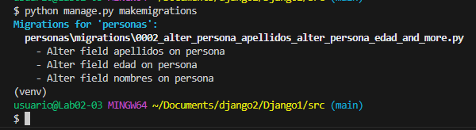

</tr>
<tr>
-   Ahora ejecutamos el comando python manage.py migrate:

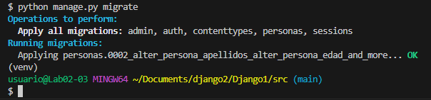


</tr><tr>
-   Luego insertamos datos desde el shell:

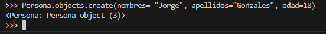

</tr><tr>
-   Aqui podemos observar los cambios hechos desde el shell, en la imagen se 
observa desde el administrador los datos insertados.

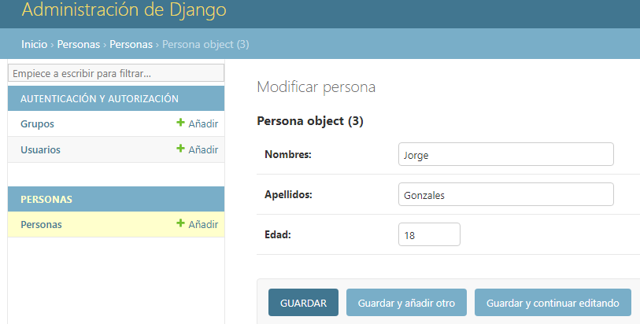
</tr><tr>

-   Ahora insertaremos un nuevo campo "donador", esta modificación la realizaremos
 en el models.py de la app personas, entonces modificaremos el modelo:

```python
    class Persona(models.Model):
        nombres = models.CharField(max_length = 100)
        apellidos = models.CharField(max_length = 100)
        edad = models.IntegerField()
        donador = models.BooleanField()
```

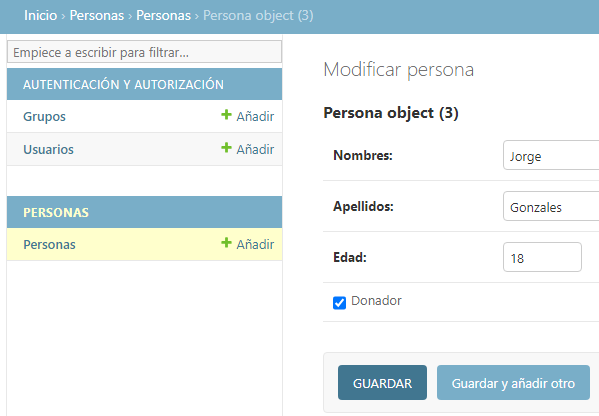
</tr><tr>

-   Luego de estos cambios ejecutamos el comando python manage.py makemigrations

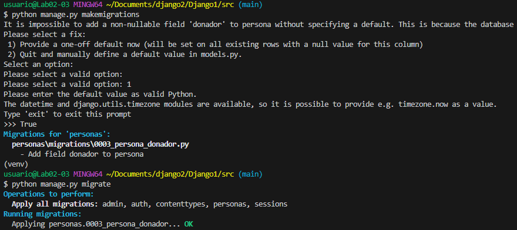
</tr><tr>


-   Creando la aplicacion inicio "python manage.py startapp inicio".

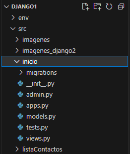
</tr><tr>


-   Agregando en el settings.py del proyecto la app inicio:

```python
    INSTALLED_APPS = [
    'django.contrib.admin',
    'django.contrib.auth',
    'django.contrib.contenttypes',
    'django.contrib.sessions',
    'django.contrib.messages',
    'django.contrib.staticfiles',
    'personas',
    'inicio',
]
```

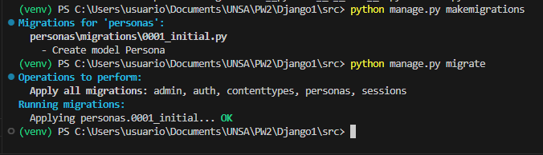

</tr><tr>
-   Modificamos el views.py de la app inicio:

```python
    from django.shortcuts import render
    from django.http import HttpResponse

    # Create your views here.
    def myHomeView(*args, **kwargs):
        return HttpResponse('<h1>Hola Mundo desde Django</h1>')
```

</tr><tr>
-   Insertamos la ruta el urls.py de listaContactos:

```python
    from django.contrib import admin
    from django.urls import path
    from inicio.views import myHomeView

    urlpatterns = [
        path('', myHomeView, name = 'Página de inicio'),
        path('admin/', admin.site.urls),
    ]
```

</tr><tr>

-   Corremos el servidor y observamos las modificaciones:

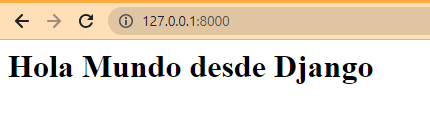

</tr><tr>

- Trabajaremos un poco mas con peticiones y ruteos URL, 
en listaContactos modificaremos en el urls.py, aumentaremos 
el path 'another'
```python
     path('another/', myHomeView, name = 'Página de inicio'),
```
- Observamos en el navegador 'another':
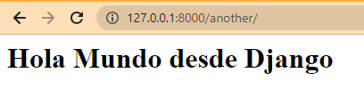

- Crearemos una nueva vista en views.py de la app inicio 
creamos la función anotherView:
```python
    def anotherView(request):
        return HttpResponse('<h1>Sólo otra Página</h1>')
```
- En listaContactos direccionamos la ruta en el path:
```python
    from inicio.views import anotherView

    urlpatterns = [
        path('', myHomeView, name = 'Página de inicio'),
        path('another/', anotherView),
        path('admin/', admin.site.urls),
    ]
```
- Finalmente observamos los resultados en el navegador:
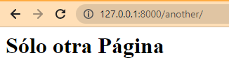

- Ahora veremos que las funciones de las vistas reciben argumentos,
pasaremos como argumento request a la función myHomeView:

```python
    def myHomeView(request, *args, **kwargs):
        print(args, kwargs)
        print(request.user)
        return HttpResponse('<h1>Hola Mundo desde Django</h1>')
```
- Observamos en la consola del servidor los print de la función:
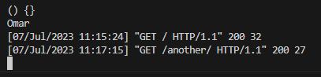

- Trabajando con plantillas, creamos una carpeta template donde guardaremos nuestros
HTML, es decir las plantillas seran nuestros Html, la lógica será el views y la ruta
será urls, dentro de templates creamos "home.html"
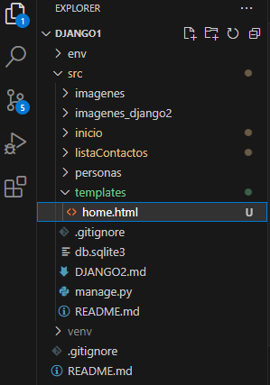

- Insertamos código en el home:

```python
    <!DOCTYPE html>
    <head>
    <meta charset="UTF-8">
    <meta name="viewport" content="width=device-width, initial-scale=1.0">
    <title>Template Base</title>
    </head>
    <body>
        <h1>Hola Mundo Desde DJango</h1>
        <h2>Con Templates</h2>
    </body>
    </html>
```
- Modificamos el setting de listaContacto y el views.py de inicio:

```python
    import os
    'DIRS': [os.path.join(BASE_DIR, "templates")],
```
```python
    def myHomeView(request, *args, **kwargs):
        print(args, kwargs)
        print(request.user)
        return render (request, "home.html", {})
```
- Finalmente observamos desde el navegador:
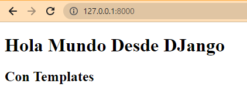 


Observamos la persona insertada desde el shell:


</tr><tr>

## La estructura de nuestro laboratorio quedo de la siguiente manera:<br>

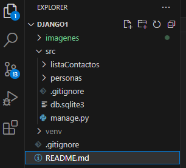

</tr><tr>

## Para realizar el presente laboratorio, se han realizado los siguientes commit:<br>
</td><tr>

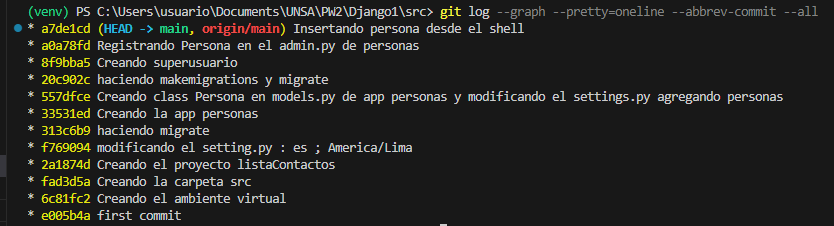

</tr><tr>

-  


<tr><td colspan="6">II. SOLUCIÓN DE CUESTIONARIO: <br>

-   No hay cuestionario para esta réplica 


</tr>
</tr>
<tr><td colspan="6">III. CONCLUSIONES:

-   Podemos ver que el framework django ya tiene por defecto el servidos sqlite. 
</tr>

</tdbody>
</table>


<table>
<theader>
<tr><th colspan="6">RETROALIMENTACIÓN GENERAL</th></tr>
</theader>
<tbody>
</tr>
<tr><td colspan="6">
<ul>
<li><a </a></li>
<li><a </a></li>
<li><a </a></li>
</ul>
</td>
</<tr>
</tdbody>
</table>


<table>
<theader>
<tr><th colspan="6">REFERENCIAS BIBLIOGRÁFICAS</th></tr>
</theader>
<tbody>
</tr>
<tr><td colspan="6">
<ul>
<li>https://www.tutorialspoint.com/What-are-pyc-files-in-Python#:~:text=pyc%20files%20are%20created%20by,is%20newer%20than%20the%20corresponding%20.</li>
<li>https://stackoverflow.com/questions/8822335/what-do-the-python-file-extensions-pyc-pyd-pyo-stand-for#:~:text=you've%20written.-,.,later%20easier%20(and%20faster).
</li>
<li>https://web.archive.org/web/20160130165632/http://www.network-theory.co.uk/docs/pytut/CompiledPythonfiles.html
</li>

<li></li>
</ul>
</td>
</<tr>
</tdbody>
</table>


