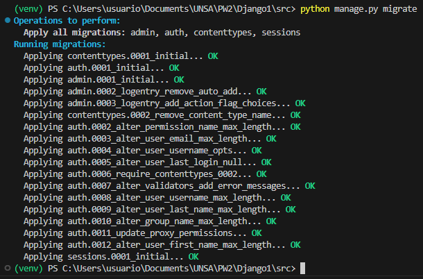

# INFORME DE LABORATORIO DAJANGO 2
<div align="center">
<table>
    <theader>
        <tr>
            <td></td>
            <th>
                <span style="font-weight:bold;">UNIVERSIDAD NACIONAL DE SAN AUGUSTIN</span><br />
                <span style="font-weight:bold;">FACULTAD DE INGENIERÍA DE PRODUCCIÓN Y SERVICIOS</span><br />
                <span style="font-weight:bold;">ESCUELA PROFESIONAL DE INGENIERÍA DE SISTEMAS</span>
            </th>
                  </tr>
    </theader>
    <tbody>
        <tr><td colspan="3"><span style="font-weight:bold;">Formato</span>: Guía del Estudiante / Talleres / Centros de Simulación</td></tr>
        <tr><td><span style="font-weight:bold;">Aprobación</span>:  2023/06/08</td><td><span style="font-weight:bold;">Código</span>: GUIA</td><td><span style="font-weight:bold;">Página</span>: 1</td></tr>
    </tbody>
</table>
</div>

<div align="center">
<span style="font-weight:bold;">GUÍA DEL ESTUDIANTE</span><br />
<span>(formato del estudiante)</span>
</div>


<table>
<theader>
<tr><th colspan="6">INFORMACIÓN BÁSICA</th></tr>
</theader>
<tbody>
<tr><td>ASIGNATURA:</td><td colspan="5">Programación Web 2</td></tr>
<tr><td>TÍTULO DE LA PRÁCTICA:</td><td colspan="5">Laboratorio 05</td></tr>
<tr>
<td>NÚMERO DE PRÁCTICA:</td><td>04</td><td>AÑO LECTIVO:</td><td>2023 A</td><td>NRO. SEMESTRE:</td><td>III</td>
</tr>
<tr>
<td>FECHA INICIO::</td><td>JUN-2023</td><td>FECHA FIN:</td><td>JUN-2023</td><td>DURACIÓN:</td><td>04 horas</td>
</tr>
<tr><td colspan="6">INTEGRANTE:
<ul>
<li>ROMERO CHIPANA OMAR -------------------- oromero@unsa.edu.pe</li>
</ul>
</td>
</<tr>
<tr><td colspan="6">DOCENTE:
<ul>
<li>Carlo CORRALES DELGADO</li>
</ul>
</td>
</<tr>
</tdbody>
</table>


<table>
<theader>
<tr><th colspan="6">SOLUCIÓN Y RESULTADOS</th></tr>
</theader>
<tbody>
</tr>
<tr><td colspan="6">
<tr>
#I. RÉPLICA DE LA TEORÍA DE DJANGO2:
A. <br><br>
-   En esta parte contuamos con Django 2 a partir de lo que ya se 
hizo en Django 1:
- Empezmos con la modificacion del models.py modificando:
    
```python
    class Persona(models.Model):
        nombres = models.CharField(max_length = 100)
        apellidos = models.CharField(max_length = 100)
        edad = models.IntegerField()
```


</tr>
<tr>
-   Ahora modificamos las zonas horarias y esto lo hacemos en el settings.py
    reeplazamos de acuerdo a nuestras configuraciones, quedando de la siguiente
    manera:

```python
      LANGUAGE_CODE = 'es'
      TIME_ZONE = 'America/Lima'
      USE_I18N = True
      USE_TZ = True
```


</tr><tr>
-   Luego creamos la carpeta src, activamos nuestro entorno virtual, estamos listos
    para hacer migracion con el comando "python manage.py migrate"



</tr><tr>
-   En este paso se observa que al parecer aparece un error, esto es debido a que se 
    debe realizar el makemigrations, accion que se realizara mas adelante.


</tr><tr>

-   Luego creamos la aplicacion personas a traves del comando django-admin startapp personas.


</tr><tr>
-   Dentro del models.py de personas creamos la class Persona:


</tr><tr>
-   Em este punto ejecutamos el comando python manage.py makemigratios.


</tr><tr>
-   ¿Que archivos se modificaron al hacer makemigrations y migrate?
    Se crea el archivo 0001_inital.py


</tr><tr>
-   Ahora creamos el superusuario:


</tr><tr>

-   Insertando una persona desde el shell:


</tr><tr>


-   Observamos la persona insertada desde el shell:


</tr><tr>

## La estructura de nuestro laboratorio quedo de la siguiente manera:<br>


</tr><tr>

## Para realizar el presente laboratorio, se han realizado los siguientes commit:<br>
</td><tr>


</tr><tr>

-  


<tr><td colspan="6">II. SOLUCIÓN DE CUESTIONARIO: <br>

-   No hay cuestionario para esta réplica 


</tr>
</tr>
<tr><td colspan="6">III. CONCLUSIONES:

-   Podemos ver que el framework django ya tiene por defecto el servidos sqlite. 
</tr>

</tdbody>
</table>


<table>
<theader>
<tr><th colspan="6">RETROALIMENTACIÓN GENERAL</th></tr>
</theader>
<tbody>
</tr>
<tr><td colspan="6">
<ul>
<li><a </a></li>
<li><a </a></li>
<li><a </a></li>
</ul>
</td>
</<tr>
</tdbody>
</table>


<table>
<theader>
<tr><th colspan="6">REFERENCIAS BIBLIOGRÁFICAS</th></tr>
</theader>
<tbody>
</tr>
<tr><td colspan="6">
<ul>
<li>https://www.tutorialspoint.com/What-are-pyc-files-in-Python#:~:text=pyc%20files%20are%20created%20by,is%20newer%20than%20the%20corresponding%20.</li>
<li>https://stackoverflow.com/questions/8822335/what-do-the-python-file-extensions-pyc-pyd-pyo-stand-for#:~:text=you've%20written.-,.,later%20easier%20(and%20faster).
</li>
<li>https://web.archive.org/web/20160130165632/http://www.network-theory.co.uk/docs/pytut/CompiledPythonfiles.html
</li>

<li></li>
</ul>
</td>
</<tr>
</tdbody>
</table>


